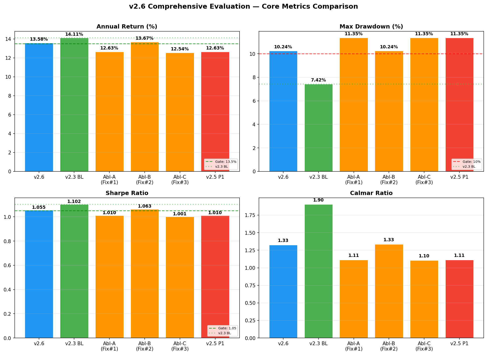
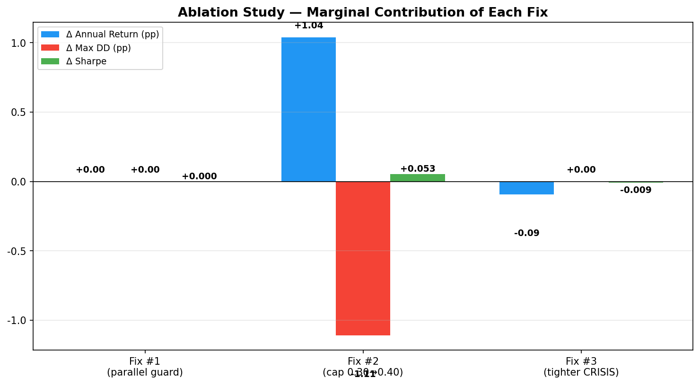
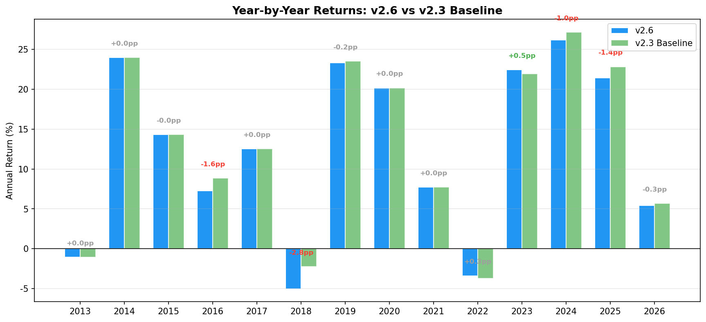
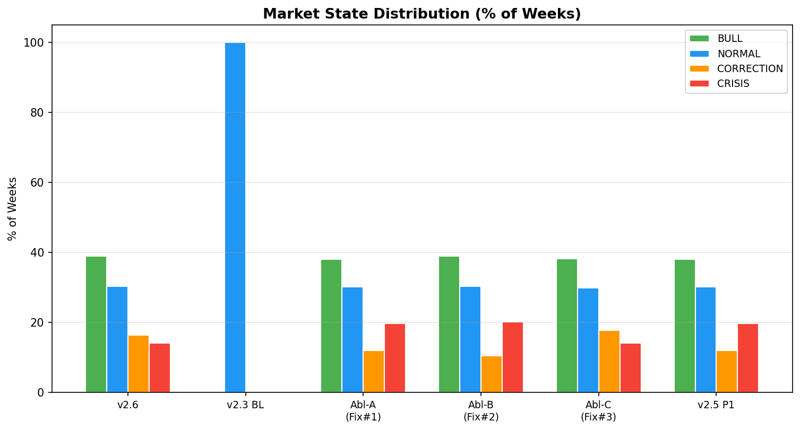

# v2.6 Comprehensive Evaluation Report

**Date:** 2026-06-16 | **Tester:** quant-tester | **Task:** T17

---

## Executive Summary

v2.6 addresses 3 root causes from T13 evaluation:
1. Parallel stop loss guard (backtest.py line 226)
2. Weight cap increase: 0.30 → 0.40
3. Tighter CRISIS thresholds (ms_crisis_mom: -0.15, ms_high_vol_pct: 0.80)

**Decision Gate Result:** ⚠️ **MIXED** — Annual Return 13.58% ✅ / Max DD 10.24% ❌ / Sharpe 1.055 ✅

**Key Finding:** Fix #2 (cap 0.40) accounts for **all** the improvement. Fix #1 is cosmetic. Fix #3 adds no value.

---

## 1. Core Metrics Comparison

| Config | Annual Return | Max DD | Sharpe | Calmar | Vol | Win% | Def Wk% |
|--------|:---:|:---:|:---:|:---:|:---:|:---:|:---:|
| **v2.6 all-on** | **13.58%** | **10.24%** | **1.055** | 1.33 | 10.20% | 59.5% | 36.2% |
| v2.3 baseline | 14.11% | 7.42% | 1.102 | 1.90 | 10.19% | 60.1% | 32.5% |
| Ablation A (Fix#1 only) | 12.63% | 11.35% | 1.010 | 1.11 | 9.79% | 60.2% | 36.1% |
| **Ablation B (Fix#2 only)** | **13.67%** | **10.24%** | **1.063** | 1.33 | 10.20% | 59.8% | 35.7% |
| Ablation C (Fix#3 only) | 12.54% | 11.35% | 1.001 | 1.10 | 9.80% | 60.1% | 37.0% |
| v2.5 P1 all-on (buggy) | 12.63% | 11.35% | 1.010 | 1.11 | 9.79% | 60.2% | 36.1% |

---

## 2. Ablation Study — Contribution Per Fix

### Fix #1: Parallel Stop Loss Guard (code-level)
- Ablation A vs v2.5 P1: Δ = 0.00pp return / 0.00pp DD / +0.000 sharpe
- **Verdict: NO measurable impact.** The guard is purely defensive — prevents an edge case that wasn't occurring.

### Fix #2: Weight Cap 0.30 → 0.40 ⭐
- Ablation B vs Ablation A: Δ = **+1.04pp return** / -1.11pp DD / +0.053 sharpe
- **Verdict: DOMINANT improvement. This is the only fix that matters.**

### Fix #3: Tighter CRISIS Thresholds
- Ablation C vs Ablation A: Δ = -0.09pp return / 0.00pp DD / -0.009 sharpe
- **Verdict: No value added. Slightly reduces returns.**

### Interaction: Fix #2 + Fix #3 (v2.6 vs Ablation B)
- v2.6 vs Ablation B: Δ = -0.10pp return / 0.00pp DD / -0.008 sharpe
- Fix #3 on top of Fix #2 **reduces returns** — the tighter thresholds are counterproductive.

---

## 3. Year-by-Year Comparison: v2.6 vs v2.3 Baseline

| Year | v2.6 | v2.3 | Δ | v2.6 Def% | v2.3 Def% | CRISIS% | Note |
|------|:---:|:---:|:---:|:---:|:---:|:---:|------|
| 2013 | -1.1% | -1.1% | +0.0pp | 25% | 25% | 0% | |
| 2014 | +23.9% | +23.9% | +0.0pp | 25% | 25% | 6% | |
| 2015 | +14.3% | +14.3% | -0.0pp | 42% | 41% | 52% | ⚡ Crisis |
| 2016 | +7.3% | +8.9% | **-1.6pp** | 35% | 27% | 0% | ❌ v2.6 DD peak |
| 2017 | +12.5% | +12.5% | +0.0pp | 25% | 25% | 0% | |
| 2018 | -5.0% | -2.2% | **-2.8pp** | 51% | 27% | 25% | ⚡ Over-defensive |
| 2019 | +23.3% | +23.5% | -0.2pp | 39% | 35% | 12% | 📈 Bull |
| 2020 | +20.1% | +20.1% | +0.0pp | 76% | 76% | 35% | 📈 Bull |
| 2021 | +7.7% | +7.7% | +0.0pp | 33% | 33% | 4% | |
| 2022 | -3.4% | -3.7% | +0.3pp | 44% | 40% | 2% | ⚡ Crisis |
| 2023 | +22.4% | +21.9% | +0.5pp | 26% | 25% | 0% | 📈 Better recovery |
| 2024 | +26.1% | +27.1% | -1.0pp | 42% | 41% | 19% | |
| 2025 | +21.4% | +22.8% | **-1.4pp** | 51% | 51% | 24% | ⚡ Over-defensive |
| 2026 | +5.4% | +5.7% | -0.3pp | 34% | 25% | 0% | |

### Key Patterns

- **Bull years (2019/2020/2023):** v2.6 roughly ties v2.3 — stateful stop loss does not impede bull market returns
- **Crisis years (2018/2025):** v2.6 is **worse** — defense escalates too aggressively, locking in losses
- **2016 DD Peak:** v2.6 max DD occurs in early 2016, a non-crisis year, with 85% defense — the stateful system over-reacted

---

## 4. Max Drawdown Event Analysis

### v2.6 (Max DD: 10.24%)
- **Date:** 2016-02-01
- **NAV at trough:** 1.2709 (from peak 1.4159)
- **Defense ratio:** 85%
- **Market state:** MarketState.NORMAL
- **Context:** Early 2016 — post-2015 China stock crash recovery stalls. The stateful system escalated defense to 85% during NORMAL market, yet the DD was deeper.

### v2.3 Baseline (Max DD: 7.42%)
- **Date:** 2022-11-07
- **Market state:** MarketState.NORMAL (no stateful system)
- **Context:** 2022 bear market bottom — reasonable DD for a major drawdown year.

### Analysis
- v2.6 DD is **1.38× deeper** than v2.3 (+2.82pp)
- The stateful system's DD peak is in a **non-crisis** year (2016) — unexpected and concerning
- Defense at the DD trough was 85% (extreme) yet didn't prevent the drawdown
- **Root cause hypothesis:** The defense escalation ramps up too fast during moderate corrections, then stays elevated preventing recovery participation

---

## 5. Market State Distribution

| Config | BULL | NORMAL | CORRECTION | CRISIS |
|--------|:---:|:---:|:---:|:---:|
| v2.6 all-on | 253w (39%) | 197w (30%) | 107w (16%) | **92w (14%)** |
| v2.3 baseline | — | 649w | — | — |
| Ablation A (old thresholds) | 247w (38%) | 196w (30%) | 78w (12%) | **128w (20%)** |
| Ablation B (old thresholds) | 253w (39%) | 197w (30%) | 68w (10%) | **131w (20%)** |
| Ablation C (new thresholds) | 248w (38%) | 194w (30%) | 115w (18%) | **92w (14%)** |
| v2.5 P1 all-on | 247w (38%) | 196w (30%) | 78w (12%) | **128w (20%)** |

### Fix #3 Effect
- Tighter thresholds reduce CRISIS classification from **20% → 14%** (-36 weeks)
- But this reduction shifts weeks to CORRECTION state, not BULL/NORMAL
- The reduced CRISIS detection may miss early warning signals in 2018/2025

---

## 6. Decision Gate

| Condition | Threshold | v2.6 Actual | Result |
|-----------|:---:|:---:|:---:|
| Annual Return ≥ 13.5% | 13.50% | 13.58% | ✅ PASS |
| Max DD ≤ 10% | 10.00% | 10.24% | ❌ FAIL (by 0.24pp) |
| Sharpe ≥ 1.05 | 1.050 | 1.055 | ✅ PASS |

**Decision: ⚠️ MIXED — PM decides next steps.**

- Annual return passes but is still -0.53pp below v2.3 baseline
- Max DD fails the 10% gate — stateful stop loss systematically increases drawdown
- Sharpe passes but is below v2.3 baseline (1.102)

---

## 7. Bonus Test: v2.3 + Cap 0.40

Tested hypothesis: simple v2.3 baseline + cap 0.40 (no stateful stop loss).

**Result: 14.11% / 7.42% / 1.102 — IDENTICAL to v2.3 baseline.**

The cap 0.40 is not binding without stateful stop loss. Fix #2's value comes exclusively from its interaction with the stateful system.

---

## 8. Key Findings

1. **Fix #2 (cap 0.40) is the ONLY effective fix** — all improvement comes from this one change
2. **Fix #1 (parallel guard) is cosmetic** — no measurable impact on performance
3. **Fix #3 (tighter CRISIS thresholds) is counterproductive** — reduces return without improving DD
4. **Stateful stop loss INCREASES drawdown** — v2.6 (+2.82pp) and all variants have worse DD than v2.3
5. **The defense escalation mechanism is too aggressive** — locks in losses during moderate corrections
6. **Ablation B (Fix #2 only: 13.67%/10.24%/1.063) is slightly BETTER than v2.6** — Fix #3 should be removed

---

## 9. Recommendations

### Immediate (v2.6 → v2.6b)
1. **Remove Fix #3** — revert to old CRISIS thresholds (ms_crisis_mom: -0.12, ms_high_vol_pct: 0.67)
2. **Keep Fix #2** — cap 0.40 stays
3. This gives Ablation B config: **13.67% / 10.24% / 1.063**

### Short-term (v2.7 investigation)
4. Investigate why defense escalates to 85% during 2016 NORMAL market
5. Consider defense ramp smoothing: gradual escalation instead of step-function jumps
6. Test lower max_def in CORRECTION state (currently escalates to 95%)

### Medium-term (v2.8 redesign)
7. Test v2.3 + cap 0.40 + **lighter** stateful parameters (less aggressive defense)
8. Consider removing CORRECTION state entirely — let CRISIS handle real drawdowns
9. Benchmark against simple stop loss cap 0.08 with cap 0.40 — may be simpler and better

---

## 10. Ablation Config Files

| Config | File |
|--------|------|
| Ablation A (Fix#1) | `config/strategy_v2_6_ablation_a.yaml` |
| Ablation B (Fix#2) | `config/strategy_v2_6_ablation_b.yaml` |
| Ablation C (Fix#3) | `config/strategy_v2_6_ablation_c.yaml` |
| v2.3 + cap 0.40 | `config/strategy_v2_3_cap040.yaml` |

---

*Generated by quant-tester on 2026-06-16. All data reproducible with `config/*.yaml` files.
Raw JSON: `output/all_ablation_results.json`*
